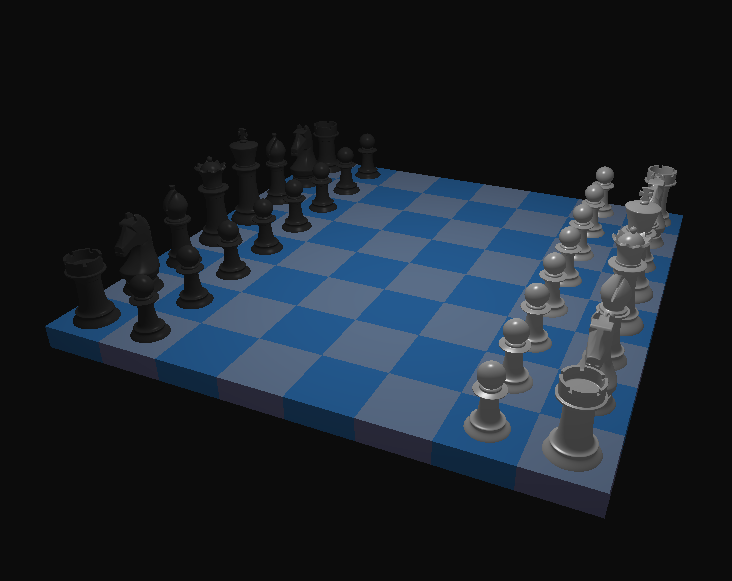

# 3D Chess OpenGL

3D Chess made using C++ and OpenGL. I am using this as a fun project to implement some of what I have learned about OpenGL and improve my C++ skills. It is still in early development, but here is a first look at the rendered chess board: 

